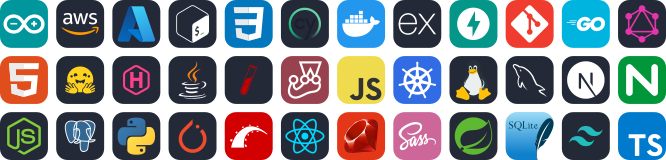

# Hi 👋, I'm Nick Clyde

### A full-stack software engineer and proud dad to identical twin girls.

  

  

- 🔭 I'm currently working on:
  - **[DIBBs](https://github.com/CDCgov?q=dibbs)**, a suite of tools to help state and local public health departments get the data they need to save lives, including [Query Connector](https://github.com/CDCgov/dibbs-query-connector) and [Text-to-Code](https://github.com/CDCgov/dibbs-text-to-code)
  - **[Sac Retro Game Club](https://sacretrogame.club)**, a community for retro gaming fans in Sacramento and beyond
  - **[Apollo Reborn](https://github.com/Apollo-Reborn/Apollo-Reborn)**, keeping the Apollo Reddit app alive with your own API keys, unlocked Ultra features, and more

- 🌱 I'm currently learning **Next.js, Go, Logos**

- 📫 How to reach me **nick@twindad.dev**

- ⚡ Fun fact **I love going to concerts! Ask me about my favorite bands.**

<!-- - 👨‍💻 All of my projects are available at **[https://clyde.tech](https://clyde.tech)** -->

- 📝 I write articles at **[https://twindad.dev](https://twindad.dev)**

- 📄 Know about my experiences **[https://www.linkedin.com/in/nick-clyde](https://www.linkedin.com/in/nick-clyde)**

<h3 align="left">Connect with me:</h3>
<table><tr>
<td></td>
<td></td>
</tr></table>

<h3 align="left">Languages and Tools:</h3>

&nbsp;

